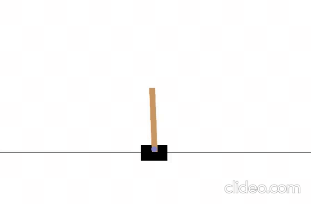
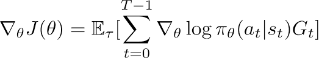
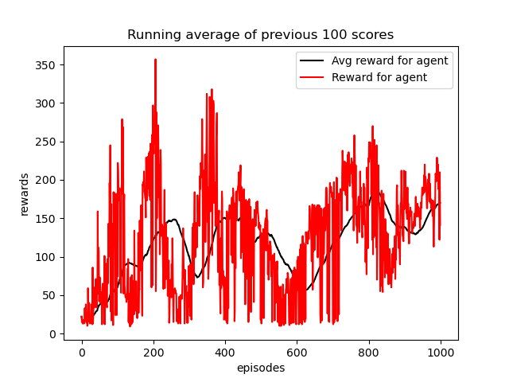

<table>
  <tr>
    <td>Random Agent</td>
     <td>Trained for 900 episodes(4x speed)</td>
  </tr>
  <tr>
    <td></td>
    <td></td>
  </tr>
 </table>

## The description of the task
 - A pole is attached by an un-actuated joint to a cart, which moves along a frictionless track. The pendulum is placed upright on the cart and the goal is to balance the pole by applying forces in the left and right direction on the cart. It can take two actions, moving left or moving right. Since the goal is to keep the pole upright for as long as possible, a reward of +1 for every step taken, including the termination step, is allotted. The threshold for rewards is 475 for v1. For v0, the maximum steps is 200, for v1 it is 500. So for each step, if we kept the pole upwright we get +1 reward, so the maximum reward in v1 is 500.

Source: https://www.gymlibrary.dev/environments/classic_control/cart_pole/

## Policy Gradient
- Policy Gradient, is a policy based reinforcement learning algorithm. Which does'nt rely on the expilict value. It uses the implicit value for generating the policy.
- Here, the network is known as a policy network, unlike DQN, it does'nt outputs q-values, instead it output the action probabilities itself. So, the network is known as a Policy Network.
- Policy network, takes state as an input and provides the action probabilities, from that action will selected randomly. Algorithm need a way to quantify, how good the policy. to do that, it uses the value of that state, in the policy gradient, for calculation the value, monte-carlo prediction is used.
- So,the policy gradient, is also known as monte-carlo policy gradient or reinforce algorithm.

    

- So, for the policy network, it uses the value function approximation, for the state value calculation, it uses the monte-carlo target.
- Policy-based rl algorithm, can be used in both discrete and continuous action shape and state shape. 
- Policy Gradient, learns the stohastic policy.
- But the problem with policy gradient is that it can be used only in episodic task. Because it uses the monte-carlo target.
- Because, it uses monte-carlo target, the algorithm has a high variance and low bias.
    - We can use Policy Gradient with baselines to solve the problem of variance.

## Setup for running in local environment
Install python 3.7, if not already installed, to install in debian distro use,  

    $ sudo apt install python3.7
Install git, if not ready installed, to install in debian distro use,
    
    $ sudo apt install git 

Open terminal and execute the below commands, 

    $ git clone https://github.com/shilu10/rl-.git
    $ cd rl-/policy_gradient/ 
    $ rm model_training_results.txt
    $ rm -r videos/ 
    $ sudo apt install python3-pip 
    $ python3 -m venv policy_gradient_env/
    $ source policy_gradient_env/bin/activate/
    $ pip3 install -r requirements.txt 

Now, you are ready to go and run this project refer the below sections to understand the project structure to train and test the Reinforcement Learning Model.

## Components
The implementation of the project is in python and it is included in the below files:
    lunarlander.py : Agent for landing successfully the 'Lunar Lander' which is implemented in Gymnasium.

    Files:

    agent.py                 : Contains the agent code, which will interact with the environement.
    network.py               : Contains the Neural Network with 2 Hidden Layers with relu activation function build using tensorflow subclassing.
    telegram_bot.py          : It is used to send the message to the person regarding the training. (Note: training takes days to complete).
    train.py                 : It contains the trainer class, which will combines the agent and env code.
    eval.py                  : This contains the Eval Class, which is used to evaluate the trained agent.
    pong_env.py              : This file contains code for running the code for pong environment.
    cartpole.py           : This file contains code for running the code for CartPole environment with Policy Gradient.
    utils.py                 : This contains the extra code like wrapper function for the environment, plot function, etc.
    writer.py                : This contains the writer class, which is used to record the training statistic in the text format.
    video_recorder.py        : This contains the video recorder class, which is used to record the video of the environment while agent interacts. (default freq: 100 episode)

## System Requirements (Dependencies)
The script has been developed and verified in a Python 3.7 environment. Installation details of python, can be found in the following link: Python Installation

The script imports the below packages:

    matplotlib, version 2.2.2
    numpy, version 1.14.4
    pandas, version 0.23.0
    gymnasium, version 0.10.8
    Keras, version 2.2.4
    tensorflow, version 2.11.0
Need not install all of this packages, if you followed the instruction to setting up this project.

## Training the agent and Testing a trained agent
The training of the agent can be started by the following script execution:

    $ python lunarlander_env.py 

    Episode: 603, Epsilon: 0.1, Steps:391, Reward: 220.58, Best reward: 289.32, Avg reward: 36.07
    Episode: 604, Epsilon: 0.1, Steps: 589, Reward: 264.10, Best reward: 289.32, Avg reward: 38.36
    Episode: 605, Epsilon: 0.1, Steps: 954, Reward: -193.77, Best reward: 289.32, Avg reward: 36.27
    .....

    - The training ends when the default convergence criteria are met (he average total reward over 100 consecutive runs is at least 230). The trained agent is stored in the models/ directory for future use.
    - It also does the evaluation of the trained model for 10 episode.

<table>
  <tr>
     <td> Rewards and Average Reward by Policy Gradient Agent</td>
  </tr>
  <tr>
    <td></td>
  </tr>
 </table>

In Combined Experience Replay paper, authors used epsilon-greedy policy, instead of decaying epsilon-greedy policy. And also used offset value of 1. which is, for each sampling batch, batch will contains batch_size - 1 random sampled value, and last value in the replay buffer.

## What's New 
Implementation of Double DQN, Double Dueling DQN, and using the PER (Priortized Experience Replay).

## References
1. OpenAI Gym, arXiv:1606.01540v1 [cs.LG].
2. Playing Atari with Deep Reinforcement.
3. Learning, arXiv:1312.5602v1 [cs.LG].
https://keras.io