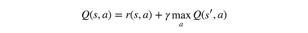
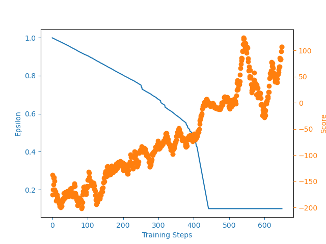
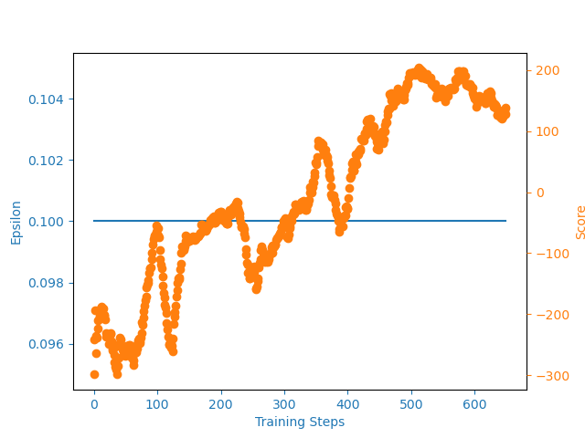

<table>
  <tr>
    <td>Random Agent</td>
     <td>Trained for 650 episodes(4x speed)</td>
  </tr>
  <tr>
    <td></td>
    <td></td>
  </tr>
 </table>

## The description of the task
Landing pad is always at coordinates (0,0). Coordinates are the first two numbers in state vector. Reward for moving from the top of the screen to landing pad and zero speed is about 100..140 points. If lander moves away from landing pad it loses reward back. Episode finishes if the lander crashes or comes to rest, receiving additional -100 or +100 points. Each leg ground contact is +10. Firing main engine is -0.3 points each frame. Solved is 200 points. Landing outside landing pad is possible. Fuel is infinite, so an agent can learn to fly and then land on its first attempt. Four discrete actions available: do nothing, fire left orientation engine, fire main engine, fire right orientation engine.

Source: https://gymnasium.farama.org/environments/box2d/lunar_lander

## Deep Q-Learning
- Q-Learning, is off-policy learning method and also it learns online, unlike Monte-Carlo Control, which learns Offline.
- Q-learning is off-policy method of TD Learning, which uses the similar idea of Bellman Optimiality Equation, where for finding the Q(s, a) (q value for current state, action pair), it does a one-step look ahead by taking the action by following the Epsilon-Greedy Policy, and adds the Reward and maximum q-value of next state and all action.

    

- Problem with naive Q-learning model, is that it uses the table lookup method, which is not effecient for the continuous action space.

- So, Q-learning can be used with the function approximation, where instead of using the Tables for storing Q-values, Parametric function will be used instead. 
- Q-learning with Deep Neural Nets(function approximator), there is a drawback in the naive Q-learning with Neural Nets, it does not have a stable training. So instead of Q-learning with Neural Nets, the DQN is preferred. And also q-learning with function appro can be thought of Supervised Learning, and supervised learning also have 2 assumptions. 
    1. Stable target Value.
    2. IID (Independent and Indentical Distrubution Data).
Q-learning voilates both of the assumptions. 

## Deep Q Network (DQN)
- DQN, solves the problem of unstable training in the Q-learning with Neural Nets.
- For solving the problem of stable target value, it uses the seperate network.
- For solving the problem of non-idd data, it uses the replay buffer.
- so in the DQN, there are two neural networks.
    1. Target Q-value network.
    2. Q-value network.

## Improvement of Experience Replay
- Experience Replay is one of the breakout in the reinforcement learning community, it is extensively used in many of the algorithms.
- Variants of Experience Replay:    
    1. Vanilla experience replay.
    2. hindsight experience replay.
    3. combined experience replay.
    3. priortized experience replay.

## Setup for running in local environment
Install python 3.7, if not already installed, to install in debian distro use,  

    $ sudo apt install python3.7
Install git, if not ready installed, to install in debian distro use,
    
    $ sudo apt install git 

Open terminal and execute the below commands, 

    $ git clone https://github.com/shilu10/dqn_project.git
    $ cd dqn_project/ 
    $ rm array_files/* 
    $ rm model_training_results.txt
    $ rm -r videos/ 
    $ sudo apt install python3-pip 
    $ python3 -m venv dqn_project_env/
    $ source dqn_project_env/bin/activate/
    $ pip3 install -r requirements.txt 

Now, you are ready to go and run this project refer the below sections to understand the project structure to train and test the Reinforcement Learning Model.

## Components
The implementation of the project is in python and it is included in the below files:
    lunarlander.py : Agent for landing successfully the 'Lunar Lander' which is implemented in Gymnasium.

    Files:

    agent.py                 : Contains the agent code, which will interact with the environement.
    network.py               : Contains the Neural Network with 2 Hidden Layers with relu activation function build using tensorflow subclassing.
    experience_replay.py     : Contains the code for vanilla experience replay. Which is just a buffer, that stores the data.
    telegram_bot.py          : It is used to send the message to the person regarding the training. (Note: training takes days to complete).
    train.py                 : It contains the trainer class, which will combines the agent and env code.
    eval.py                  : This contains the Eval Class, which is used to evaluate the trained agent.
    pong_env.py              : This file contains code for running the code for pong environment.
    lunarlander.py           : This file contains code for running the code for LunarLander environment with vanila experience replay.
    lunarlander_cer.py       : This file contains code for lunarlander environemtn with combined experience replay
    utils.py                 : This contains the extra code like wrapper function for the environment, plot function, etc.
    writer.py                : This contains the writer class, which is used to record the training statistic in the text format.
    video_recorder.py        : This contains the video recorder class, which is used to record the video of the environment while agent interacts. (default freq: 100 episode)

## System Requirements (Dependencies)
The script has been developed and verified in a Python 3.7 environment. Installation details of python, can be found in the following link: Python Installation

The script imports the below packages:

    matplotlib, version 2.2.2
    numpy, version 1.14.4
    pandas, version 0.23.0
    gymnasium, version 0.10.8
    Keras, version 2.2.4
    tensorflow, version 2.11.0
Need not install all of this packages, if you followed the instruction to setting up this project.

## Training the agent and Testing a trained agent
The training of the agent can be started by the following script execution:

    $ python lunarlander_env.py 

    Episode: 603, Epsilon: 0.1, Steps:391, Reward: 220.58, Best reward: 289.32, Avg reward: 36.07
    Episode: 604, Epsilon: 0.1, Steps: 589, Reward: 264.10, Best reward: 289.32, Avg reward: 38.36
    Episode: 605, Epsilon: 0.1, Steps: 954, Reward: -193.77, Best reward: 289.32, Avg reward: 36.27
    .....

    - The training ends when the default convergence criteria are met (he average total reward over 100 consecutive runs is at least 230). The trained agent is stored in the models/ directory for future use.
    - It also does the evaluation of the trained model for 10 episode.

<table>
  <tr>
    <td>Agent without CER</td>
     <td>Agent with CER</td>
  </tr>
  <tr>
    <td></td>
    <td></td>
  </tr>
 </table>

In Combined Experience Replay paper, authors used epsilon-greedy policy, instead of decaying epsilon-greedy policy. And also used offset value of 1. which is, for each sampling batch, batch will contains batch_size - 1 random sampled value, and last value in the replay buffer.

## What's New 
Implementation of Double DQN, Double Dueling DQN, and using the PER (Priortized Experience Replay).

## References
1. OpenAI Gym, arXiv:1606.01540v1 [cs.LG].
2. Playing Atari with Deep Reinforcement.
3. Learning, arXiv:1312.5602v1 [cs.LG].
https://keras.io
